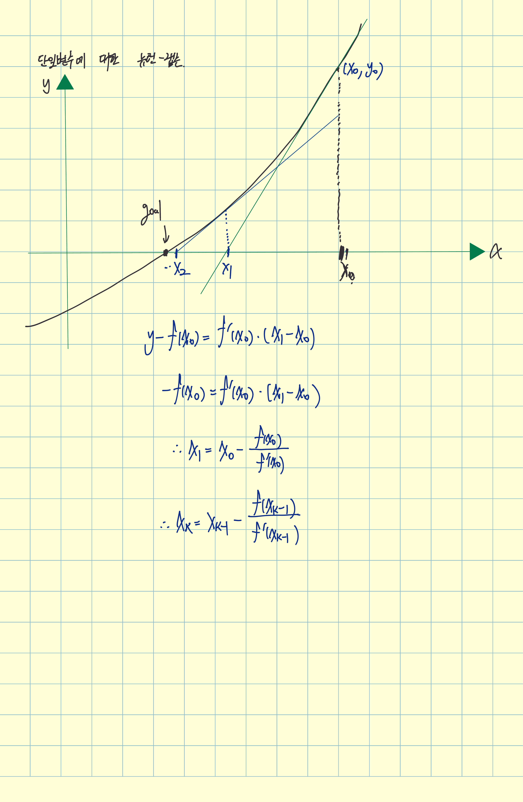
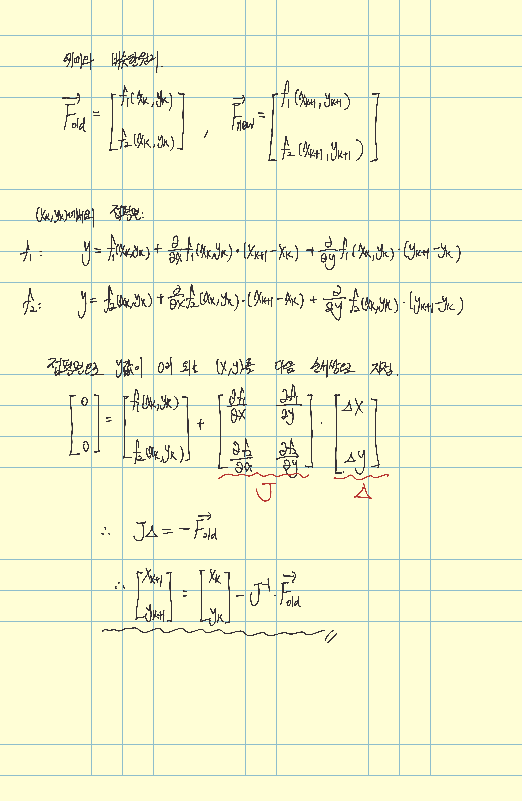

# Mathematical Derivation

## Single-variable Newton-Raphson Method



In the single-variable case, the Newton-Raphson method is easy to visualize.

Starting from an initial approximation, we repeatedly use the tangent line of the function to obtain a new approximation. If the iteration converges, these approximations get closer and closer to a root.

The key idea is that the new approximation is obtained from the equation of the tangent line.

At $x_n$, the tangent line of $f(x)$ is

```math
y-f(x_n)=f'(x_n)(x-x_n).
```

The next approximation $x_{n+1}$ is the x-intercept of this tangent line, so we set $y=0$.

```math
-f(x_n)=f'(x_n)(x_{n+1}-x_n).
```

Therefore,

```math
x_{n+1}
=
x_n-\frac{f(x_n)}{f'(x_n)}.
```

This gives the basic Newton-Raphson iteration for a single-variable function.

---

## Multivariable Newton-Raphson Method



In the multivariable case, we can think of each polynomial function as a surface.

In the single-variable case, a new approximation was obtained using a tangent line.  
Similarly, in the two-variable case, we can use the tangent plane of each function around the current approximation.

Geometrically, this can be understood using tangent planes. More generally, it is the first-order Taylor approximation of the vector-valued function.

Suppose

```math
F(\mathbf{x})
=
\begin{bmatrix}
f_1(\mathbf{x}) \\
f_2(\mathbf{x})
\end{bmatrix},
```

where

```math
\mathbf{x}
=
\begin{bmatrix}
x \\
y
\end{bmatrix}.
```

Around the current approximation $\mathbf{x}_k$, the first-order approximation is

```math
F(\mathbf{x}_k+\mathbf{h})
\approx
F(\mathbf{x}_k)
+
J(\mathbf{x}_k)\mathbf{h},
```

where $J(\mathbf{x}_k)$ is the Jacobian matrix.

For two functions of two variables,

```math
J(\mathbf{x}_k)
=
\begin{bmatrix}
\frac{\partial f_1}{\partial x} & \frac{\partial f_1}{\partial y} \\
\frac{\partial f_2}{\partial x} & \frac{\partial f_2}{\partial y}
\end{bmatrix}_{\mathbf{x}=\mathbf{x}_k}.
```

We want the next approximation to make both function values close to zero, so we set

```math
F(\mathbf{x}_k+\mathbf{h})
\approx
\mathbf{0}.
```

Then,

```math
J(\mathbf{x}_k)\mathbf{h}
=
-F(\mathbf{x}_k).
```

If we define

```math
\boldsymbol{\delta}_k=-\mathbf{h},
```

then

```math
J(\mathbf{x}_k)\boldsymbol{\delta}_k
=
F(\mathbf{x}_k),
```

and the update becomes

```math
\mathbf{x}_{k+1}
=
\mathbf{x}_k-\boldsymbol{\delta}_k.
```

If this process converges, the approximation becomes closer to a point where both function values are zero.

However, convergence is not guaranteed for every initial point.

An important condition is that the Jacobian must be invertible for the Newton step to be uniquely determined. If the Jacobian is singular at the current point,

```math
\det J(\mathbf{x}_k)=0,
```

the Newton step cannot be uniquely determined in the usual way.

Therefore, depending on the initial point, the iteration may fail because a singular Jacobian is encountered.

---

## Connection to the Implementation

The Newton-Raphson formula is often written as

```math
\mathbf{x}_{k+1}
=
\mathbf{x}_k
-
J(\mathbf{x}_k)^{-1}F(\mathbf{x}_k).
```

However, the implementation does not explicitly compute the inverse matrix.

Instead, it solves the linear system

```math
J(\mathbf{x}_k)\boldsymbol{\delta}_k
=
F(\mathbf{x}_k)
```

directly using

`np.linalg.solve(Jacobian, F_old)`

and then updates the approximation using

```math
\mathbf{x}_{k+1}
=
\mathbf{x}_k-\boldsymbol{\delta}_k.
```

This avoids explicitly computing the inverse matrix and directly matches the linear system used in the Newton-Raphson iteration.
